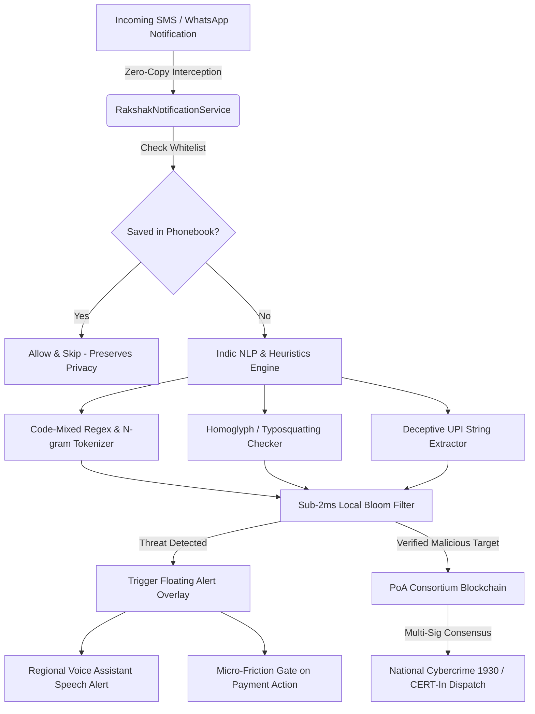

<div align="center">

# 🛡️ RAKSHAK AI (रक्षक AI)
### **Next-Gen On-Device Cyber Threat Detection & Proof-of-Authority Fraud Consortium**

[](https://opensource.org/licenses/MIT)
[](https://developer.android.com)
[](https://kotlinlang.org)
[](https://react.dev)
[](https://vitejs.dev)
[](https://tailwindcss.com)
[](#)

*An AI-powered, zero-copy, privacy-first cybersecurity defense shield against modern digital financial fraud, social engineering scams, Indic language phishing, deceptive UPI debit traps, and malicious RAT APKs.*

</div>

---

## 📌 Table of Contents
- [Executive Overview](#-executive-overview)
- [The 5 Critical Blind Spots Solved](#-the-5-critical-blind-spots-solved)
- [System Architecture & Core Engines](#-system-architecture--core-engines)
- [Key Features](#-key-features)
- [Repository Structure](#-repository-structure)
- [Getting Started & Installation](#-getting-started--installation)
  - [1. Web Interactive Dashboard & Phone Simulator](#1-web-interactive-dashboard--phone-simulator)
  - [2. Native Android Application (Kotlin)](#2-native-android-application-kotlin)
- [Hackathon Judge Evaluation Bench](#-hackathon-judge-evaluation-bench)
- [Security & Privacy Model](#-security--privacy-model)
- [Contributing & License](#-contributing--license)

---

## 🌟 Executive Overview

In India, over **80% of cyber financial scams** (electricity bill disconnection, KYC suspension, APK RAT sideloading, and UPI cashback debit traps) exploit social engineering and conversational vernacular languages (**Hinglish, Tanglish, Telglish, Benglish**). 

Traditional antivirus solutions fail because:
1. They require users to manually copy-paste links (high friction).
2. Cloud-based analysis leaks private conversations and banking SMS OTPs.
3. Scammers use phonetic English spellings and typosquatted lookalikes that bypass regex filters.

**Rakshak AI** solves this with a **dual-layer architecture**:
- **On-Device Real-Time Passive Defense**: An Android service listening directly for incoming SMS/WhatsApp notifications and intercepting threats using phonetic N-gram models, a local Bloom filter, and real-time floating heads-up alert overlays.
- **Proof-of-Authority (PoA) Threat Consortium**: A decentralized, Sybil-immune threat intelligence ledger operated by verified institutional authorities (RBI Partner Banks, CERT-In, National Cyber Crime Helpline 1930) that syncs verified threat hashes in under 2ms.

---

## 🎯 The 5 Critical Blind Spots Solved

```
┌──────────────────────────────────────────────────────────────────────────┐
│                   RAKSHAK AI MULTI-LAYER DEFENSE MATRIX                 │
└──────────────────────────────────────────────────────────────────────────┘
  [1. UX Reality Check]     ───▶ Zero-Copy Passive Notification Interception
  [2. Code-Mixed NLP]       ───▶ Phonetic N-Gram Engine for Indic Dialects
  [3. Malicious APK Auditor]───▶ Sideloaded RAT & Permission Heuristic Engine
  [4. Offline Resilience]   ───▶ Sub-2ms Compressed Bloom Filter (50k+ Hashes)
  [5. Anti-Poisoning PoA]   ───▶ Multi-Sig Consortium Consensus with 1930 / RBI
```

| Blind Spot | Traditional Antivirus / Regex | Rakshak AI Defense Engine |
| :--- | :--- | :--- |
| **1. UX Burden** | Requires manual copy-paste of SMS/links | **Zero-Copy passive Android NotificationListener** with floating threat shield |
| **2. Language Nuance** | Pure English dictionaries only | **Phonetic phonetic similarity + Code-mixed N-grams** (Hinglish/Tanglish) |
| **3. Financial Traps** | Scans URLs only, misses UPI intents | **Micro-Friction Gate** intercepts deceptive UPI PIN entry on "Cashback" |
| **4. APK Sideloads** | Checks hash on Google Play | **Static Android Manifest bytecode auditor** for dangerous accessibility/SMS RATs |
| **5. Threat Poisoning** | Centralized database or public spam | **Sybil-Immune PoA Consortium Blockchain** with cryptographic validator staking |

---

## 🏗️ System Architecture & Core Engines



### 1. Indic Code-Mixed NLP Engine (`src/engine/codeMixedNlp.js` & `IndicNlpEngine.kt`)
Detects high-urgency psychological extortion patterns in code-mixed romanized vernaculars (e.g., *"Bijli bill update nahi hua to raat 9 baje power cut ho jayegi"* or *"YONO KYC blocked, click to verify PAN"*).

### 2. Banking & Typosquatting Detector (`src/engine/urlDetector.js`)
Uses Levenshtein Distance algorithms combined with canonical Indian bank domain profiles (SBI, HDFC, ICICI, PNB, Paytm) to flag deceptive homoglyphs (e.g., `sbi-kyc-update.top`, `paytm-cashback-claim.xyz`).

### 3. Deceptive UPI Debit Trap Gate (`src/engine/upiQrDetector.js` & `MicroFrictionActivity.kt`)
Analyzes UPI payment URIs (`upi://pay?pa=...&am=...`). When scammers attempt to disguise money requests as "Cashbacks" or "Rewards", Rakshak AI launches a modal warning users: **"STOP! UPI PIN is ONLY entered to SEND money, NEVER to receive rewards!"**

### 4. Sideloaded APK RAT Auditor (`src/engine/apkInspector.js`)
Inspects APK package permissions before installation, detecting high-risk Remote Access Trojan (RAT) combinations like:
- `android.permission.BIND_ACCESSIBILITY_SERVICE` (Keylogging & Screen reading)
- `android.permission.RECEIVE_SMS` / `READ_SMS` (OTP Sniffing)
- `android.permission.SYSTEM_ALERT_WINDOW` (Phishing Overlays)

### 5. Ultra-Fast Sub-2ms Compressed Bloom Filter (`src/engine/bloomFilter.js`)
Stores 50,000+ known malicious threat hashes in < 64KB memory footprint, enabling zero-latency threat lookups completely **offline** without battery drain or network dependencies.

### 6. PoA Consortium Threat Ledger (`src/engine/poaBlockchainSim.js`)
A decentralized, multi-signature Proof-of-Authority ledger maintained by verified validators (RBI, CERT-In, Law Enforcement) preventing database poisoning while propagating zero-day malicious domains to all protected client nodes.

---

## 📁 Repository Structure

```
Rakshak-AI/
├── android-app/                               # Native Android Kotlin Application (API 34)
│   ├── app/
│   │   ├── src/main/
│   │   │   ├── AndroidManifest.xml           # Service permissions & overlay declarations
│   │   │   ├── java/com/rakshak/ai/
│   │   │   │   ├── engine/                   # On-device Bloom Filter & Indic NLP
│   │   │   │   │   ├── ContactsWhitelistHelper.kt
│   │   │   │   │   ├── IndicNlpEngine.kt
│   │   │   │   │   └── NativeBloomFilter.kt
│   │   │   │   ├── overlay/                  # Floating Window Shield Overlay
│   │   │   │   │   └── FloatingAlertOverlayService.kt
│   │   │   │   ├── service/                  # Passive Notification Interceptor
│   │   │   │   │   └── RakshakNotificationService.kt
│   │   │   │   ├── ui/                       # Dashboard & MicroFriction UI
│   │   │   │   │   ├── MainActivity.kt
│   │   │   │   │   └── MicroFrictionActivity.kt
│   │   │   │   └── voice/                    # Multilingual TTS Voice Alerts
│   │   │   │       └── RegionalVoiceSpeaker.kt
│   │   │   └── res/                          # Vector icons, themes, layouts, XML rules
│   │   └── build.gradle.kts                  # App Gradle dependencies & SDK 34 targets
│   ├── gradle/wrapper/                       # Gradle 8.5 wrapper binaries
│   ├── gradlew.bat                           # Windows Gradle build script
│   └── settings.gradle.kts
│
├── src/                                      # React 19 Interactive Web Sandbox & Simulator
│   ├── components/
│   │   ├── ApkPermScanner.jsx                # APK Permission Forensic Scanner
│   │   ├── BlockchainLedger.jsx              # PoA Consortium Visualizer
│   │   ├── Header.jsx                        # Language & Bloom Filter HUD
│   │   ├── IncidentReportModal.jsx           # 1930 Cyber Helpline Auto-Reporter
│   │   ├── JudgePresetBar.jsx                # 1-Click Evaluation Presets
│   │   ├── MessageScanner.jsx                # SMS & WhatsApp Deep Inspector
│   │   ├── MicroFrictionModal.jsx            # UPI Debit Trap Warning Gate
│   │   ├── NotificationSimulator.jsx         # Heads-up Toast Interceptor
│   │   ├── PhoneSimulator.jsx                # Full Android OS Interactive Phone Sandbox
│   │   ├── QrScanner.jsx                     # Dynamic QR & UPI Intent Auditor
│   │   ├── SafeSandboxModal.jsx              # Isolated Virtual Browser Sandbox
│   │   ├── UrlScanner.jsx                    # Banking Typosquatting Detector
│   │   └── VoiceAssistant.jsx                # Multi-dialect Speech Synthesis
│   ├── data/
│   │   └── legitimateInstitutions.json       # Canonical Indian Banks & Utilities DB
│   ├── engine/                               # JavaScript Core Analysis Engines
│   │   ├── apkInspector.js
│   │   ├── bloomFilter.js
│   │   ├── codeMixedNlp.js
│   │   ├── poaBlockchainSim.js
│   │   ├── regionalDictionary.js
│   │   ├── upiQrDetector.js
│   │   └── urlDetector.js
│   ├── App.jsx                               # Main application container
│   ├── index.css                             # Cyberpunk Dark Glassmorphism Design System
│   └── main.jsx
│
├── package.json                              # Vite + React 19 + Tailwind CSS setup
├── tailwind.config.js                        # Theme colors & animation tokens
└── vite.config.js                            # Build bundler configuration
```

---

## 🚀 Getting Started & Installation

### 1. Web Interactive Dashboard & Phone Simulator

The React-based web dashboard provides a complete sandbox to test, inspect, and evaluate the detection engines without needing a physical Android device.

```bash
# Clone repository
git clone https://github.com/Jishnu09-siuu/Rakshak-AI.git
cd Rakshak-AI

# Install dependencies
npm install

# Start development server
npm run dev
```

Open your browser at `http://localhost:5173`.

---

### 2. Native Android Application (Kotlin)

The native Android app runs in the background on Android 8.0+ (API 26 to 34), providing real-time notification interception and floating shield overlays.

#### Prerequisites:
- **JDK 17+** (e.g., Microsoft OpenJDK 17 or Eclipse Temurin)
- **Android SDK (API 34)** with Build-Tools `34.0.0`

#### Build APK via Command Line:
```powershell
cd android-app

# Build debug APK using Gradle Wrapper
.\gradlew.bat assembleDebug
```

#### Install on Phone / Emulator:
```powershell
# Install built APK directly via ADB
adb install -r "app\build\outputs\apk\debug\app-debug.apk"
```

---

## ⚖️ Hackathon Judge Evaluation Bench

Rakshak AI includes a built-in **1-Click Judge Evaluation Bar** at the top of the interface:

| Preset | Attack Scenario | Triggered Defense Engine |
| :--- | :--- | :--- |
| ⚡ **Hinglish Electricity Scam** | *"Aapka bijli bill update nahi hai, connection cut ho jayega..."* | Code-mixed NLP urgency detector + Notification banner + Voice alert |
| 🏦 **SBI Typosquatted Banking** | `http://sbi-bank-kyc-update.top` | Levenshtein distance check + Canonical bank domain matcher |
| 💸 **UPI Cashback Debit Trap** | `upi://pay?pa=cashback-claim@ybl&am=4999` | Micro-Friction Gate modal: "STOP! PIN sends money!" |
| 🛡️ **Malicious RAT APK** | Sideloaded banking trojan with Accessibility Service | APK Permission forensic risk scoring |
| ⛓️ **PoA Consortium Mint** | Real-time threat reporting | Multi-sig block mining into PoA Threat Ledger |

---

## 🔒 Security & Privacy Model

- **Zero-Copy Telemetry**: Message content and OTPs are analyzed 100% on-device and never leave the user's phone.
- **Phonebook Whitelisting**: Messages from saved contacts in your phonebook are immediately whitelisted, preserving privacy and saving compute.
- **No Cloud Latency**: Local Bloom Filter + N-gram heuristics deliver results in under **10 milliseconds**.
- **1930 Integration Ready**: Provides structured JSON evidence logs formatted for the Indian National Cyber Crime Reporting Portal (1930).

---

## 📜 License

Distributed under the **MIT License**. See `LICENSE` for more information.

---

<div align="center">
  <sub>Developed for Smart India Hackathon (SIH) • Problem Statement BC-01: Cybersecurity & Blockchain Solutions</sub>
</div>
